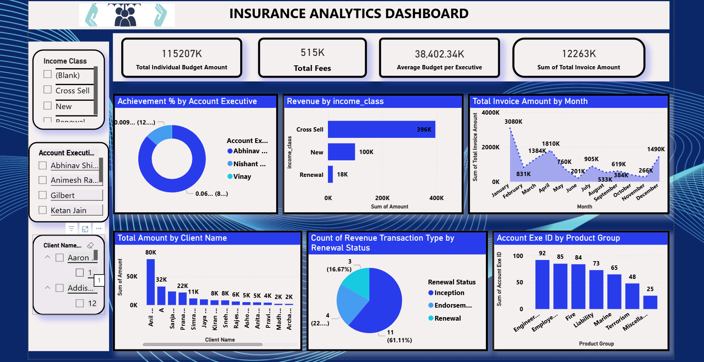
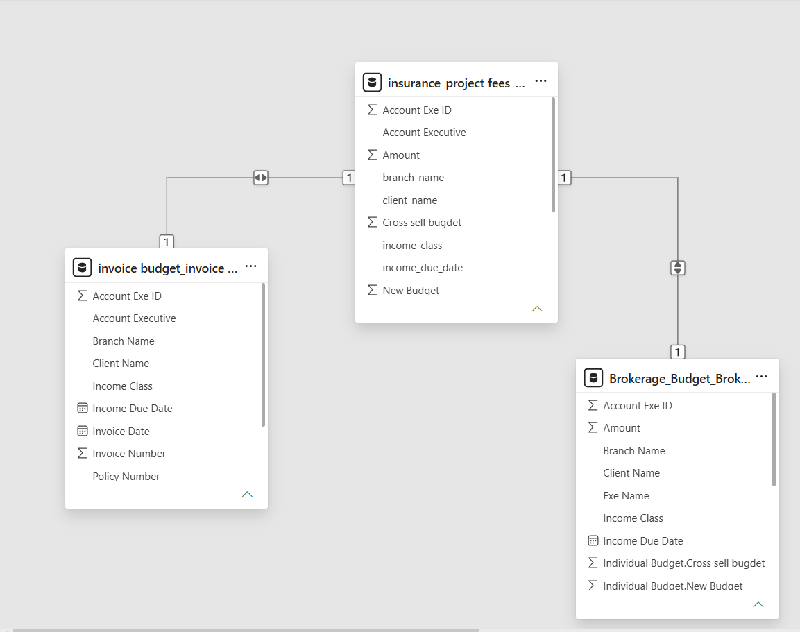

# Insurance Revenue & Budget Analytics Dashboard
This project analyzes insurance business data to uncover insights related to revenue performance, budget achievement, brokerage contribution, invoice trends, and account executive performance.
Using Power BI, Tableau, Excel, SQL, and Power Query, an interactive analytics solution was developed to help stakeholders monitor business performance and support data-driven decision-making.

---

## Business Problem

Insurance organizations manage multiple revenue streams, budgets, and client accounts. Without proper analysis, it becomes difficult to identify revenue drivers, monitor budget utilization, and evaluate business performance.
This analysis aims to answer important business questions such as:

- Which business segments generate the highest revenue?
- How effectively are budgets being utilized?
- Which account executives contribute the most revenue?
- How does brokerage revenue impact overall performance?
- What invoice trends can be identified over time?
---

## Project Objective

The objective of this project is to analyze insurance revenue and budget data to uncover insights related to financial performance, brokerage contribution, budget utilization, and executive performance using interactive dashboards.
---

## Key Metrics

- Total Revenue
- Total Budget
- Budget Achievement %
- Revenue Variance
- Total Brokerage Revenue
- Total Invoice Amount
---

## Dashboard Preview

The interactive dashboard provides a consolidated view of revenue performance, budget achievement, brokerage analysis, invoice trends, and account executive performance.

---

## Dashboard Features

- Interactive KPI tracking
- Revenue and budget analysis
- Brokerage performance monitoring
- Invoice trend analysis
- Account executive performance evaluation
- Solution group comparison

---

## Data Preparation
Power Query was used for:

- Data cleaning
- Data transformation
- Column standardization
- Data validation

---

## Data Modeling
A structured data model was created to connect revenue, budget, brokerage, and account executive datasets.

---

## SQL Analysis
SQL was used for:

- Business analysis queries
- Data modeling
- ETL processes
- Data validation

---

## Key Insights

- Revenue performance varied across business segments.
- Brokerage contributed significantly to overall revenue.
- Budget achievement differed across solution groups.
- Account executive performance showed noticeable variation.
- Invoice trends highlighted revenue fluctuations over time.

---

## Business Impact

This dashboard enables stakeholders to monitor revenue performance, evaluate budget utilization, analyze brokerage contribution, and support strategic business decisions.

---

## Tools & Technologies Used

- Power BI
- Tableau
- Excel
- SQL
- Power Query
- Data Modeling

---

## Project Workflow

1. Collected and integrated insurance datasets.
2. Performed data cleaning using Power Query.
3. Built data models and relationships.
4. Conducted SQL-based analysis.
5. Developed dashboards in Power BI, Tableau, and Excel.
6. Generated business insights and KPIs.

---

## Recommendations
- Monitor budget variance regularly.
- Focus on high-performing business segments.
- Track executive performance using KPI dashboards.
- Use invoice trends to improve forecasting.
- Leverage analytics for better business planning.

---

## Conclusion

This project demonstrates how Business Intelligence tools can transform insurance business data into actionable insights. The dashboard provides visibility into revenue performance, budget achievement, brokerage contribution, and executive effectiveness to support data-driven decision-making.
